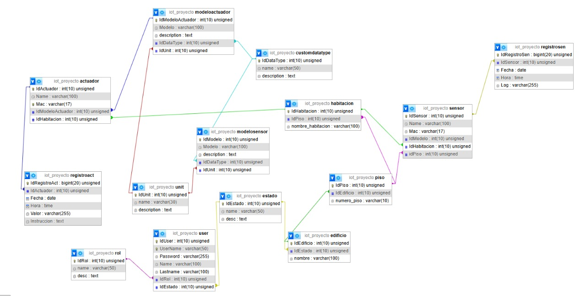
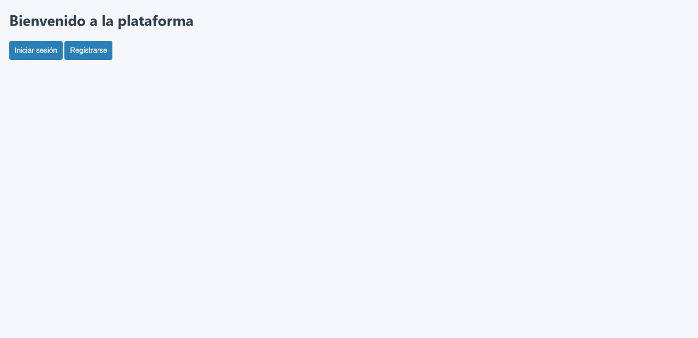
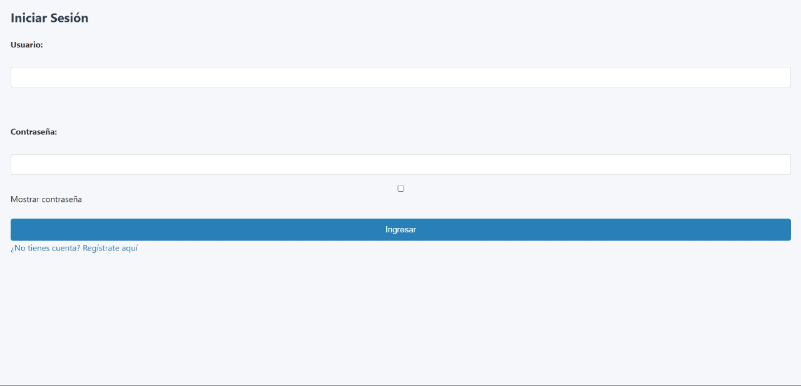
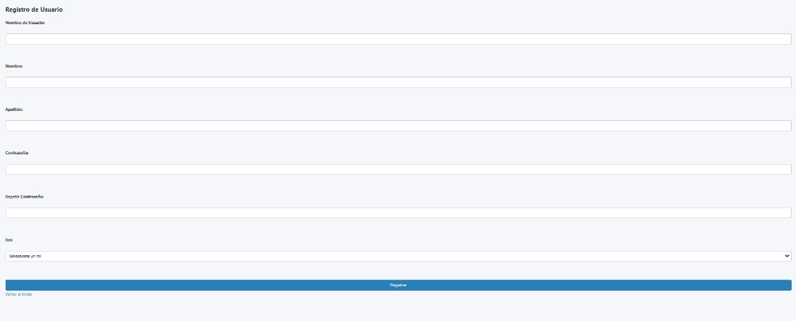
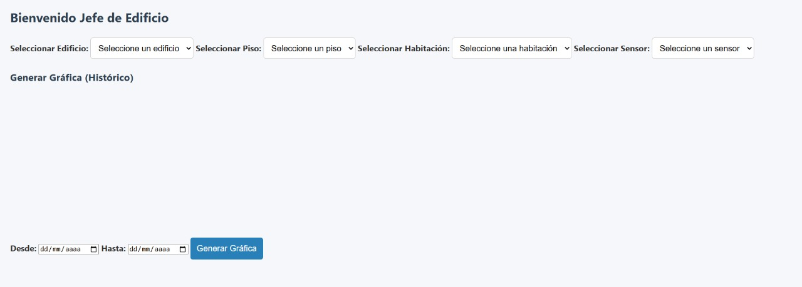
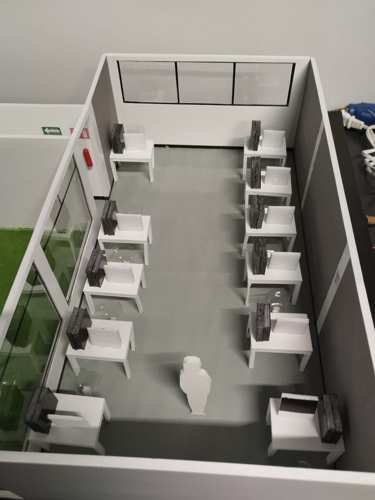

# Proyecto IoT con MQTT y MTU

Este proyecto simula un entorno IoT que conecta sensores físicos o simulados (Arduino o GUI en Python) con un servidor MQTT Mosquitto, mediante un módulo MTU escrito en Node.js. Incluye un sistema de respaldo en caso de desconexión y un subscriber en Python que permite seleccionar topics específicos por sede y piso.

---

## Estructura del Proyecto

```plaintext
PROYECTODEMODAY/
├── arduinoSens/
│   └── sensores_MTU.ino                 # Código Arduino (físico)
├── assets/
│   ├── imagenes                         # Referencias visuales
├── nodeMQTT/
│   ├── index.js                         # Código principal del MTU en Node.js
│   ├── .env                             # Configuración del entorno (SEDE, PISO, SERIAL_PORT)
│   ├── logs/                            # Carpeta donde se almacenan logs offline
│   ├── package.json                     # Dependencias y metadata
│   └── package-lock.json
├── pythonMTU/
│   ├── subscriber.py                    # Subscriber con selección de topic
│   ├── subscriberGrl.py                # Subscriber general (todos los topics)
│   ├── publisherPruebas.py              # Publisher de prueba (modo local/simulador)
│   └── logs/                            # Logs para respaldo del simulador
├── simuladorArduino/
│   └── simuladorGUI.py                  # Simulador gráfico en Tkinter (envía datos por serial)
├── procedimiento.txt                    # Guía paso a paso (formato de texto plano)
└── README.md                            # Actual archivo
```

---

## Requisitos

- Node.js y `npm`
- Python 3.10+
- `mosquitto` (servidor MQTT)
- Dependencias:
  - Node.js: `npm install mqtt serialport dotenv`
  - Python: `pip install paho-mqtt pyserial`

---

## Configuración de `.env`

Ubicado en `nodeMQTT/.env`:

```env
SEDE=amerikeCDMX
PISO=P1
SERIAL_PORT=/dev/pts/3
```

- **SEDE**: amerikeCDMX o amerikeGDJ
- **PISO**: PB, P1 o P2
- **SERIAL_PORT**: ruta del puerto virtual creado por `socat`

---

## Ejecución Paso a Paso

### 1. Crear puertos virtuales con `socat`

```bash
sudo socat -d -d pty,raw,echo=0 pty,raw,echo=0
# Anota los /dev/pts/X y /dev/pts/Y que se muestran
```

### 2. Modificar `.env` con la ruta del puerto

```env
SERIAL_PORT=/dev/pts/X  # Cambia X por el valor mostrado por socat
```

### 3. Verificar IP del servidor (en cada archivo):

- `nodeMQTT/index.js`
- `pythonMTU/subscriber.py`
- `pythonMTU/publisherPruebas.py` (si lo usas)

Busca líneas como:

```js
host: '192.168.3.52'  
```

### 4. Ejecutar servidor Mosquitto

En la máquina servidor:

```bash
mosquitto -c /etc/mosquitto/mosquitto.conf
```

Asegúrate de que tenga autenticación habilitada.

---

## 5. Ejecución por módulo

### Opción A: Simulación con GUI (sin Arduino físico)

1. Ejecuta el simulador:

```bash
python3 simuladorArduino/simuladorGUI.py
```

2. Ejecuta el MTU (lector del puerto serial):

```bash
cd nodeMQTT
node index.js
```

3. Ejecuta el subscriber (selección por topic):

```bash
cd pythonMTU
python3 subscriber.py
```

---

## Lista de Topics por Sede y Piso

| Topic MQTT                         | Descripción                             |
|-----------------------------------|-----------------------------------------|
| amerikeCDMX/PB/temp               | Temperatura sede CDMX PB                |
| amerikeCDMX/PB/hum                | Humedad sede CDMX PB                    |
| amerikeCDMX/PB/rfid               | RFID autorizado CDMX PB                 |
| amerikeCDMX/PB/rfid/denegado     | RFID denegado CDMX PB                   |
| amerikeCDMX/PB/otros             | Otros sensores sede CDMX PB             |
| ...                               | (Misma estructura para P1, P2, GDJ...)  |

---

## Descripción de la Base de Datos

El sistema contempla una base de datos que almacena toda la información generada por los sensores IoT, ya sea desde el MTU conectado directamente o tras una recuperación por caída de red. La base se compone de las siguientes tablas principales:

### Principales Entidades y Relaciones

- **`sensor`** y **`actuador`**: Representan los dispositivos físicos. Están vinculados a una habitación (`habitacion`) y asociados a un modelo (`modelosensor` o `modeloactuador`).

- **`modelosensor` / `modeloactuador`**: Contienen información sobre el modelo del dispositivo, incluyendo unidad de medida (`unit`) y tipo de dato (`customdatatype`).

- **`registrosen`**: Almacena los datos históricos capturados por sensores, incluyendo fecha, hora y valor del dato.

- **`registroact`**: Guarda los registros de control o instrucciones enviadas a los actuadores (valor, fecha, hora, instrucción).

- **`habitacion`**: Cada habitación está asociada a un `piso`, y cada `piso` pertenece a un `edificio`.

- **`user`**: Contiene la información de usuarios del sistema, los cuales pueden autenticarse y acceder a la interfaz web. Están vinculados a un `rol` y un `estado`.

- **`rol`** y **`estado`**: Determinan el perfil de acceso (alumno, coordinador, director, etc.) y el estado de actividad del usuario (activo/inactivo).

- **`unit`** y **`customdatatype`**: Definen la unidad física (ej. °C, %, booleano) y el tipo lógico de dato (ej. temperatura, humedad, RFID).

---

### Beneficios del Modelo

-  **Trazabilidad completa**: Cada lectura está asociada a sensor, ubicación, fecha y hora.
-  **Jerarquía espacial clara**: Edificio → Piso → Habitación.
-  **Control de acceso**: Roles diferenciados y estados de usuario.
-  **Integración web**: Fácil conexión con la interfaz para visualización y administración.
-  **Escalabilidad**: Permite incorporar nuevos sensores, pisos o edificios sin modificar la estructura.

---

> 

---

## Descripción del Servidor Web

```plaintext
PAGINA_IOT/
├── css/
│   ├── registro.css
│   ├── styles.css
│   ├── styles1.css
│   ├── styles2.css
│   └── styles3.css
├── img/                                 # Carpeta para imágenes usadas en la web
├── js/
│   └── graficas.js                      # Generación de gráficas dinámicas
├── alumno.php                           # Vista del alumno
├── coordinacion.php                     # Vista del área de coordinación
├── datos_select.php                     # Endpoint para selects dinámicos
├── datos_sensores.php                   # Consulta de datos desde la base
├── db.php                               # Conexión a base de datos
├── director.php                         # Vista para el director general
├── index.php                            # Página de inicio
├── jefe_edificio.php                    # Vista para jefes de edificio
├── jefe_piso.php                        # Vista para jefes de piso
├── login.php                            # Login de usuarios
├── logout.php                           # Cierre de sesión
└── registro.php                         # Registro de nuevos usuarios
```

Se planea una interfaz web que permita:

- Consultar los datos almacenados en la base de forma visual (gráficas).
- Aplicar filtros por sede, piso y tipo de sensor.
- Mostrar en tiempo real la última lectura si el servidor MQTT está activo.
- Contar con un módulo de autenticación si se activa el control de acceso.

> 
> 
> 
> 

---

## Maqueta Física (1:20)

Como parte del despliegue físico del sistema, se ha implementado una maqueta en escala 1:20 del **laboratorio de ciberseguridad de Universidad Amerike**. Esta representa:

- La sucursal: **amerikeCDMX** 
- Con el piso: **PB**
- Sensores físicos o simulados colocados en el piso

Esta maqueta se usa como referencia visual para ubicar la distribución lógica del sistema IoT y los topics MQTT.

> 

---

## Checklist Validable por Componente

| Categoría                   | Verificación                                                                                       | Observación Docente                                                                 |
|----------------------------|----------------------------------------------------------------------------------------------------|--------------------------------------------------------------------------------------|
| MQTT Server                | Servidor MQTT - Mosquitto activo; con auth básico y accesible desde red. Firewall con puertos abiertos. | Se hizo el análisis de la comunicación no encriptada, con certificado.              |
| ARDUINO con lectura/escritura de sensores y actuadores | Automatización de actuadores, lectura de sensores y envío de información de acuerdo al protocolo propio. | Se analizó el protocolo implementado buscando vulnerabilidades.                     |
| MTU (Node.js)              | Lee datos desde el puerto serial con protocolo propio, publica en el topic correcto del servidor MQTT, filtrando la información recibida del arduino. | Se analizó el protocolo implementado, junto con la comunicación no encriptada.      |
| Publisher (Python)         | Publica datos simulados para probar el protocolo MQTT.                                              | Se puede usar el servidor MQTT de pruebas.                                          |
| Subscriber (Python)        | Se suscribe a topic correcto según menú, para realizar pruebas con el protocolo MQTT.              | Se puede usar el servidor MQTT de pruebas.                                          |
| Offline logs               | Se genera archivo si MTU pierde conexión para su agregación posterior a la base de datos.          | Revisión del archivo creado en el formato correcto.                                 |
| Protocolo de comunicación MQTT | El formato debe ser válido de acuerdo al protocolo: `TEMP:`, `HUM:`, `RFID:` o `otros`.               | Correcto.                                                                           |
| Simulador ARDUINO          | Envía datos vía serial al MTU utilizando el protocolo creado, verificando la seguridad. Debe contener interfaz gráfica para su uso. | Se verificó desconectando el arduino y conectando el programa.                      |
| `socat`                    | Necesario para el uso del simulador GUI.                                                           | Correcto.                                                                           |
| Prueba de recuperación     | Al reconectar MQTT, se reenvían nuevos datos sin error, dejando de capturar en archivo de “Offline logs”. Se deben agrupar en archivos por sesión. | Funciona al desconectar la computadora de la red.                                   |
| Base de datos              | Diseño e implementación de una base de datos para guardar toda la información generada en el sistema, junto con el sistema de control de acceso. | Correcto.                                                                           |
| Servidor web               | Interfaz para la consulta de datos capturados a través del sistema. Debe implementar el sistema de control de acceso diseñado en la base de datos. Así como una visualización gráfica de los datos. | Correcto.                                                                           |


---

## Videos Explicativos DemoDay Amerike 2025

[Ver (videoDemoDay1.mp4)](./assets/videos/videoDemoDay1.mp4)

[Ver (videoDemoDay2.mp4)](./assets/videos/videoDemoDay2.mp4)

## Recomendaciones Finales

- Ejecuta siempre primero `socat` y el simulador GUI si no usas Arduino.
- No cierres la terminal de `socat`, déjala corriendo en segundo plano.
- Usa `subscriberGrl.py` si deseas visualizar todos los topics sin filtro.
- Asegúrate de que Mosquitto permita conexiones remotas si trabajas en red.

---

## Autor

Ciberseguridad 6o Semestre, Uiversidad Amerike  
Proyecto para entorno de ciberseguridad e IoT académico – 2025